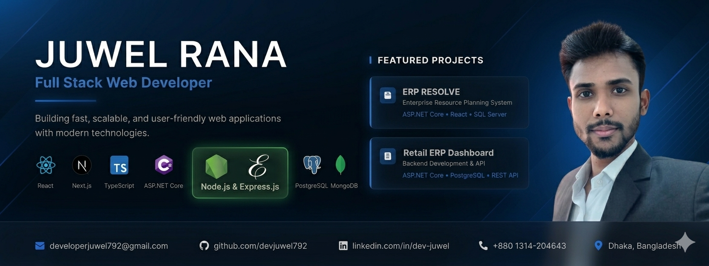

<!--<div align="center">

</div> -->


## 👋 Hi, I'm Juwel Rana
I'm a passionate **Full Stack Web Developer** with **2+ years of experience** building responsive, user-friendly web applications. I specialize in **Express.js**, **React.js**, **Next.js**, **.NET Core**, **ASP.NET Core**, and **PostgreSQL**, with a strong foundation in both frontend and backend technologies.

**What I love doing:**

- Creating seamless user experiences
- Building efficient server-side solutions
- Solving complex technical challenges
- Learning new technologies and best practices

### 💻 Tech Stack:

```
Frontend: React.js, Next.js, JavaScript, TypeScript, Tailwind CSS, HTML5, CSS3, SCSS, Material Ul
Backend: C#, ASP.NET Core, Node.js, Express.js, REST API,Entity Framwor, Prisma
Database: PostgreSQL, MongoDB, SQL Server
Tools: Git, GitHub, React Query, Redux Toolkit
```

## 🌐 Socials:

[](https://facebook.com/https://www.facebook.com/devJuwel.me) [](https://www.linkedin.com/in/dev-juwel) [](https://codepen.io/https://codepen.io/dev_juwel) [](mailto:developerjuwel792@gmail.com)

<picture align="center">
  <source media="(prefers-color-scheme: light)" srcset="https://github-readme-activity-graph.vercel.app/graph?username=devjuwel792&radius=16&theme=react&area=true&order=5&bg_color=fff&color=000&title_color=000&hide_border=false&hide_title=false"  />
  <source media="(prefers-color-scheme: dark)" srcset="https://github-readme-activity-graph.vercel.app/graph?username=devjuwel792&radius=16&theme=react&area=true&order=5"  />
  
</picture>

<picture align="center">
  <source media="(prefers-color-scheme: dark)" srcset="https://raw.githubusercontent.com/devjuwel792/devjuwel792/output/github-snake-dark.svg" />
  <source media="(prefers-color-scheme: light)" srcset="https://raw.githubusercontent.com/devjuwel792/devjuwel792/output/github-snake.svg" />
  

</picture>


### 💼 Employment

**Frontend Developer — Join Venture AI**  
📍 Dhaka | 📅 Sep 2025 – Present  
- Built responsive UI with React & Next.js  
- Integrated REST APIs and optimized performance  

**Full Stack Developer — Starsoft Ltd**  
📍 Dhaka | 📅 Jan 2025 – Sep 2025  
- Developed POS & eCommerce systems  
- Built APIs using ASP.NET Core & PostgreSQL

**Full Stack Developer — SoftTask**  
📍 Dhaka | 📅 Feb 2024 – Dec 2024  
- Developed scalable web apps with React & .NET Core  

---

### 🎓 Education

**BSc in CSE — Northern University Bangladesh**  
📅 2025 – Present  

**Diploma in Computer Technology — Dinajpur Polytechnic Institute**  
📅 2019 – 2023 | CGPA: 3.80/4.00  
### 🚀 What I Bring to the Table

- Strong problem-solving abilities with a focus on efficient solutions
- Experience in optimizing website performance and server maintenance
- Expertise in developing custom WordPress solutions
- Proficiency in modern JavaScript frameworks
- Knowledge of AI integration in web applications

### 💡 Philosophy

I believe in writing clean, maintainable code and staying current with industry trends. My approach combines technical expertise with practical problem-solving to deliver solutions that make a real impact.

### 🤝 Collaboration

I thrive in collaborative environments and enjoy working with cross-functional teams. My experience includes:

- Working closely with other developers on complex projects
- Contributing to team code reviews and technical discussions
- Mentoring junior developers
- Participating in agile development processes

### 📚 Continuous Learning

Technology never stands still, and neither do I. I'm committed to:

- Staying updated with the latest web development trends
- Exploring new technologies and frameworks
- Sharing knowledge with the developer community
- Taking on challenging projects that push my boundaries
